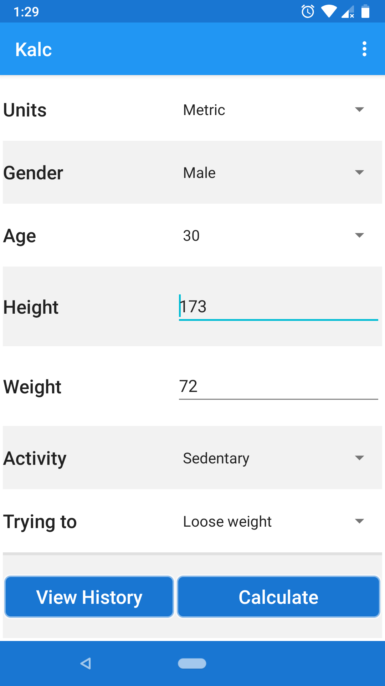
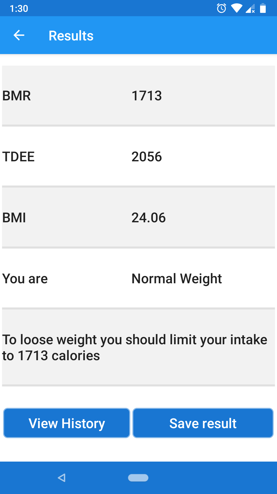
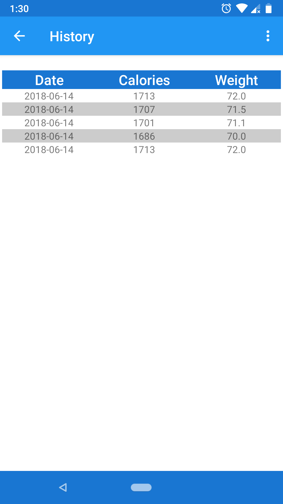
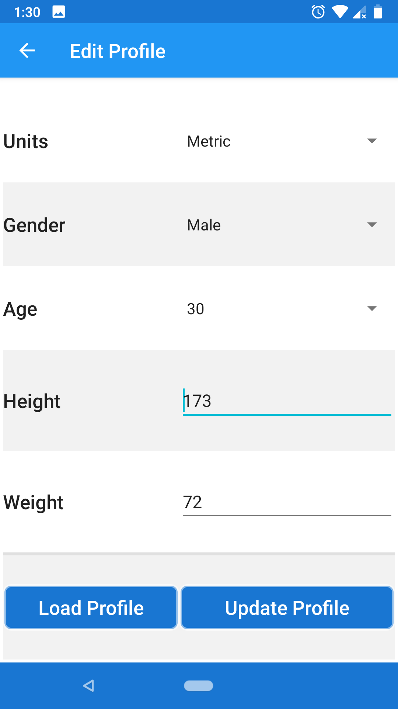

# Kalc
## Health and Fitness Buddy
A very simple privacy respecting android application to calculate required TDEE , BMR , BMI and track your intake v/s weight.

### Screenshots:

### Availability:
For now you can build apks using the code, I will try to get the app onto Google Play Store and F-Droid repo in the near future.

### Feature planned for future release:
* UI overhaul to a more material design
* Add 'One rep max' calculator
* Add Macro split and diet suggestions
* Add Weight convertor
* Add history line graphs

### Android Permissions:
* As os now the app does not require any permissions to run but this might change in future.

### Why this app exists ?
I wanted to create a completely free and open source alternative to the applications present in the Google app store. 

### Licensing:
The application is provided under GNU GPL v3, you should have received a copy of the GNU General Public License along with this program. If not, see http://www.gnu.org/licenses/.